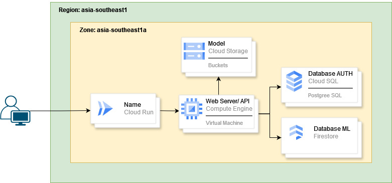

## Bangkit 2024 batch 2 Company Track Capstone
<h3>welcome to V-Count</h3>

Our project is developing a real-time vehicle counting system using machine learning and cloud computing to provide accurate traffic data across diverse conditions. This solution aims to support traffic management, urban planning, and infrastructure development by delivering reliable, scalable insights for decision-making.

# Our Team

### Team ID: C242-VC02

| Name                     | Bangkit ID    | Learning Path       | GitHub Link                               |
|--------------------------|---------------|---------------------|-------------------------------------------|
| Nadif Aulia Putra    |  M002B4KY3201 | Machine Learning    | [GitHub Profile](https://github.com/nad-if)  |
| Hanny Margaretha Aritonang| M002B4KX1720  | Machine Learning    | [GitHub Profile](https://github.com/hannyaritra)  |
| William Surya Putra      | M008B4KY4486   | Machine Learning    | [GitHub Profile](https://github.com/williamsuryap)|
| Ariqah Maulia Listiani   |  M002B4KX0652   | Machine Learning     | [GitHub Profile](https://github.com/)|
| Soultan Amirul Mukminin    | C156B4KY4196   | Cloud Computing     | [GitHub Profile](https://github.com/soul222)   |
| Berka Aldizar  | C184B4KY0839   | Cloud Computing  | [GitHub Profile](https://github.com/brrrka)|

# Project Documentation
<!DOCTYPE html>
<html lang="id">
<head>
</head>
<body>
  

<h5>Screen Shoot Web APP</h5>
  
  
  
  
  
  

   
  

  <h3> Cloud computing (CC) : </h3>
  <h5> cloud computing architecture design</h5>
  
  

   
  

  <h3> Machine Learning (ML) : </h3>
  <h5> Machine Learning Model and Training History</h5>
  
Model Information

  <table border="1" cellpadding="8">
    <tr>
      <th>Layer (type)</th>
      <th>Output Shape</th>
      <th>Param #</th>
    </tr>
    <tr>
      <td>mobilenetv2_1.00_224 (Functional)</td>
      <td>(None, 7, 7, 1280)</td>
      <td>2257984</td>
    </tr>
    <tr>
      <td>global_average_pooling2d_1 (GlobalAveragePooling2D)</td>
      <td>(None, 1280)</td>
      <td>0</td>
    </tr>
    <tr>
      <td>dense_2 (Dense)</td>
      <td>(None, 128)</td>
      <td>163968</td>
    </tr>
    <tr>
      <td>dropout_1 (Dropout)</td>
      <td>(None, 128)</td>
      <td>0</td>
    </tr>
    <tr>
      <td>dense_3 (Dense)</td>
      <td>(None, 6)</td>
      <td>774</td>
    </tr>
    <tr>
      <td colspan="2">Total params</td>
      <td>2422726 (9.24 MB)</td>
    </tr>
    <tr>
      <td colspan="2">Trainable params</td>
      <td>164742 (643.52 KB)</td>
    </tr>
    <tr>
      <td colspan="2">Non-trainable params</td>
      <td>2257984 (8.61 MB)</td>
    </tr>
  </table>
   
  
  

</body>
</html>
 

# Tech Stacks

  
  
  
  
  
  
  
  
  
  
  
  
  
  
  
  
  

  

# How use this app?

### Demo Video

